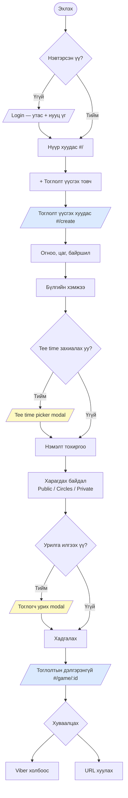
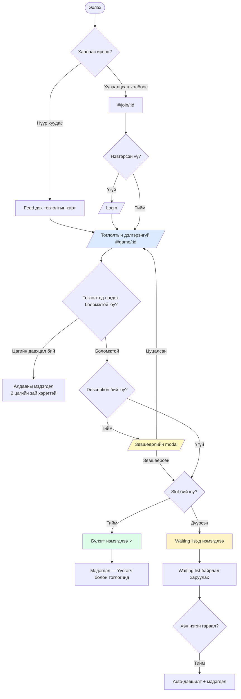
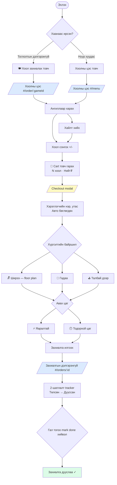
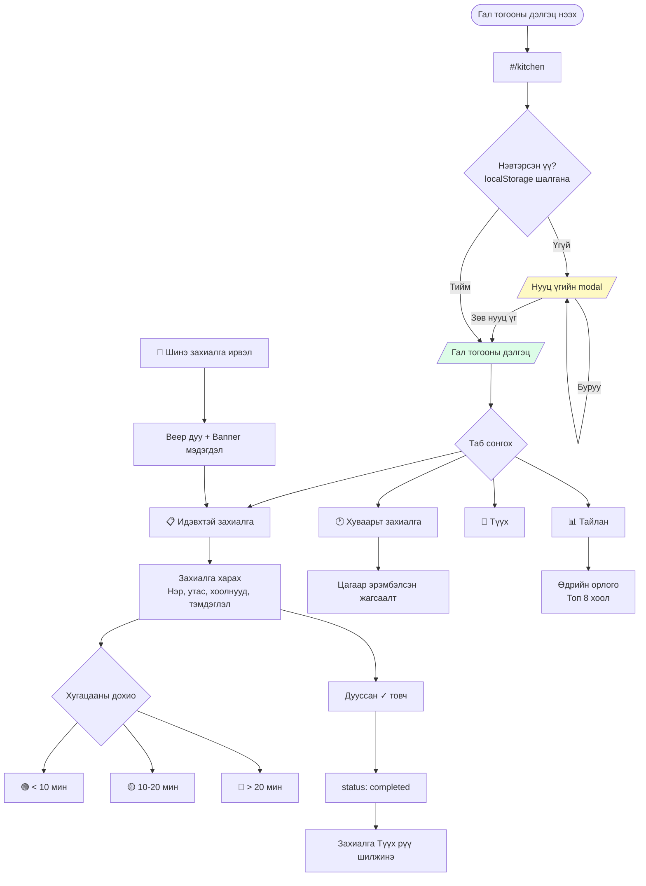
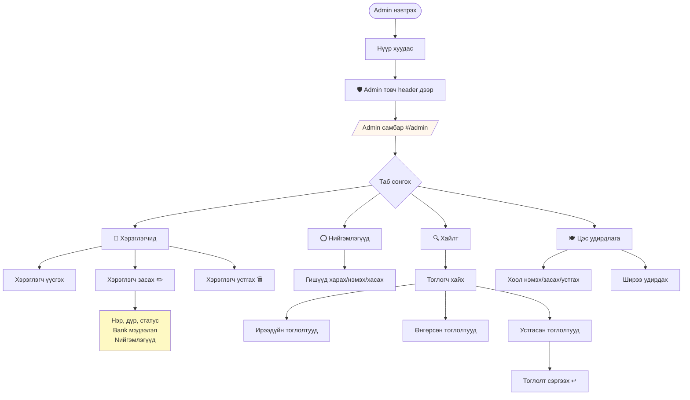
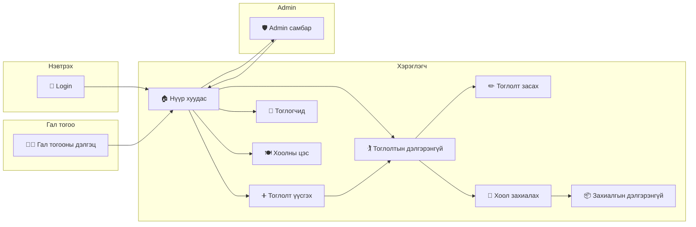

# UB Golf — User Flow

> Дизайнерт зориулсан баримт бичиг. Mermaid диаграмыг [mermaid.live](https://mermaid.live) дээр paste хийж харах эсвэл Figma/FigJam → "Import from Mermaid" ашиглана уу.

---

## Хуудсуудын жагсаалт

| Route | Хуудас | Хандах эрх |
|-------|--------|------------|
| `#/` | Нүүр хуудас (Feed) | Нэвтэрсэн |
| `#/create` | Тоглолт үүсгэх | Нэвтэрсэн |
| `#/game/:id` | Тоглолтын дэлгэрэнгүй | Нэвтэрсэн + community эрх |
| `#/join/:id` | Холбоосоор нэгдэх | Бүгд (auth redirect) |
| `#/edit/:id` | Тоглолт засах | Үүсгэгч / Admin |
| `#/users` | Тоглогчдын жагсаалт | Нэвтэрсэн |
| `#/menu` | Хоолны цэс | Нэвтэрсэн |
| `#/order/:gameId` | Хоол захиалах (тоглолттой) | Нэвтэрсэн |
| `#/orders/:id` | Захиалгын дэлгэрэнгүй | Нэвтэрсэн |
| `#/admin` | Admin самбар (5 таб) | Admin |
| `#/kitchen` | Гал тогооны дэлгэц | Kitchen нууц үг |

---

## Journey 1 — Тоглолт үүсгэх ба хуваалцах

---

## Journey 2 — Тоглолтод нэгдэх

---

## Journey 3 — Хоол захиалах

---

## Journey 4 — Гал тогооны ажилтан

---

## Journey 5 — Admin удирдлага

---

## Бүх хуудсуудын холбоос (Navigation Map)

---

## Modals / Overlays жагсаалт

| Modal | Гарах үед | Зорилго |
|-------|-----------|---------|
| Login form | Нэвтрээгүй үед | Утас + нууц үгээр нэвтрэх |
| Join confirmation | Тоглолтод нэгдэхэд (description байвал) | Нөхцөл зөвшөөрүүлэх |
| Invite players | Game detail — "Урих" товч | Тоглогч урих |
| Book tee time | Create game / Game detail | Tee time цаг захиалах |
| Checkout | Food menu — cart товч | Захиалга баталгаажуулах |
| Bank details | Тоглогчийн нэр дэргэд 💳 | Дансны мэдээлэл харах |
| Edit user | Admin → Users → ✏️ | Хэрэглэгч засах |
| Kitchen login | #/kitchen анхны нэвтрэлт | Нууц үгийн хаалга |
| Profile | Header — avatar товч | Профайл засах |
